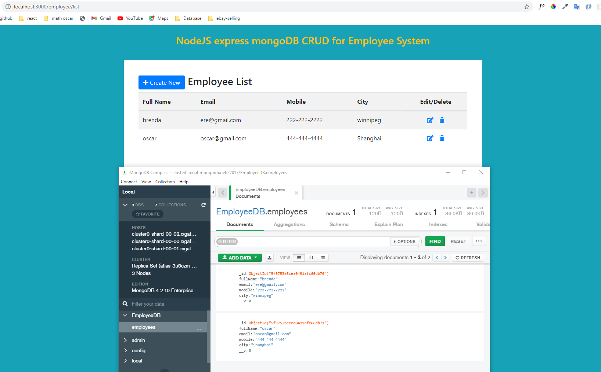

# Node js handlebars.

### Mongodb managing by using compass + Altas.

### Input info validation

### For employee system add, edit, delete feature.

### `localhost:3000 by start with: nodmon server.js`

url: localhost:3000/employee

